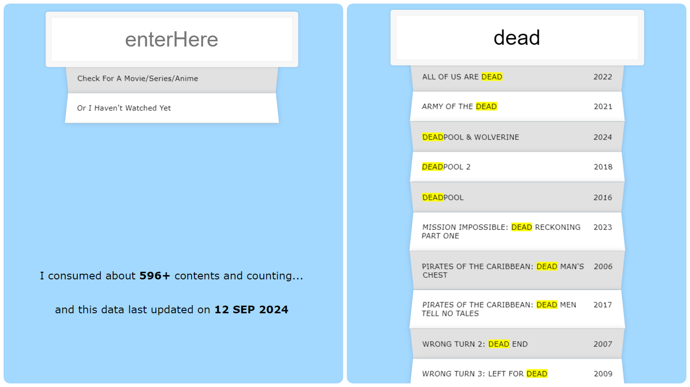

# Content Search App

A simple React application that allows users to search through a list of movies, series, or anime by name or year. The app highlights matching results and counts the total number of contents. It also features dynamic updates based on user input and displays the data with a modern, styled UI.

## Preview

## Features

- **Live Search**: Type in the input field to instantly filter and highlight the matching content based on the name or year.
- **Content Count**: The footer dynamically displays the number of contents available.
- **Highlight Matches**: The search results highlight matched parts of the text in yellow and uppercase for easy identification.
- **Modular Components**: The app is broken down into reusable components like `Input`, `Output`, `Container`, and `Footer`.

